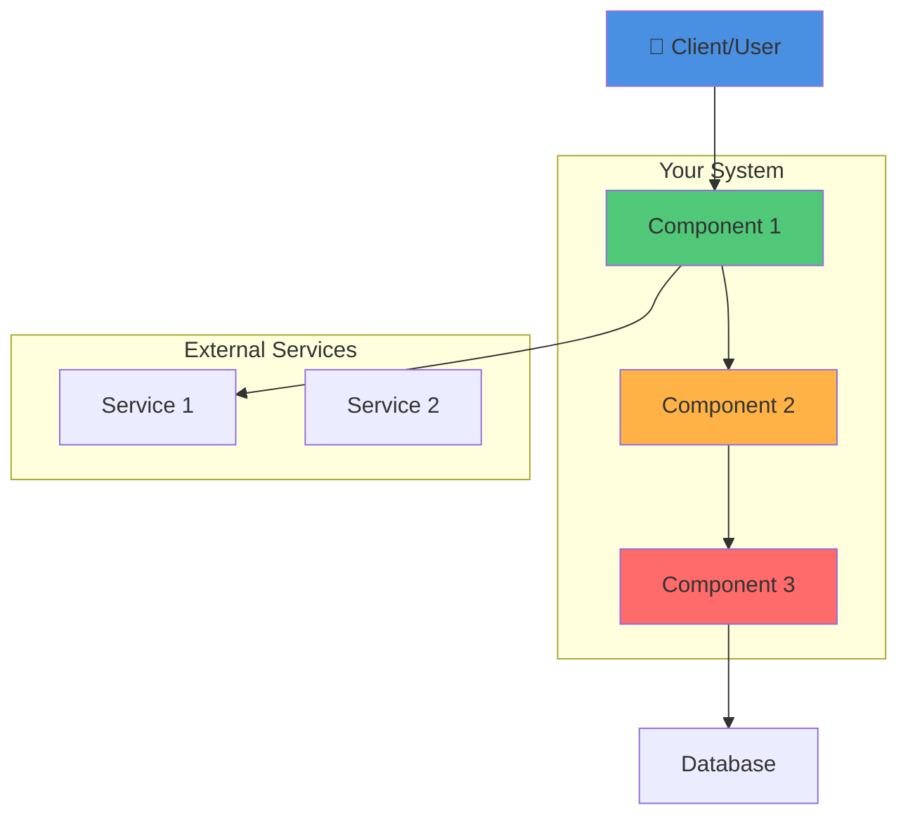
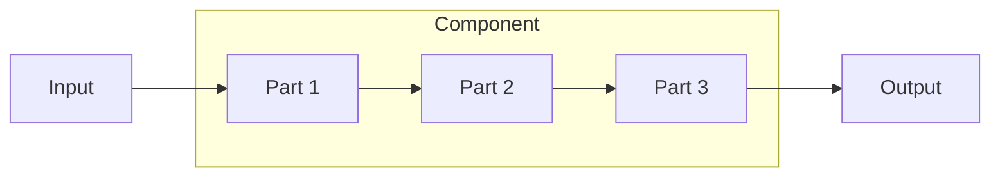
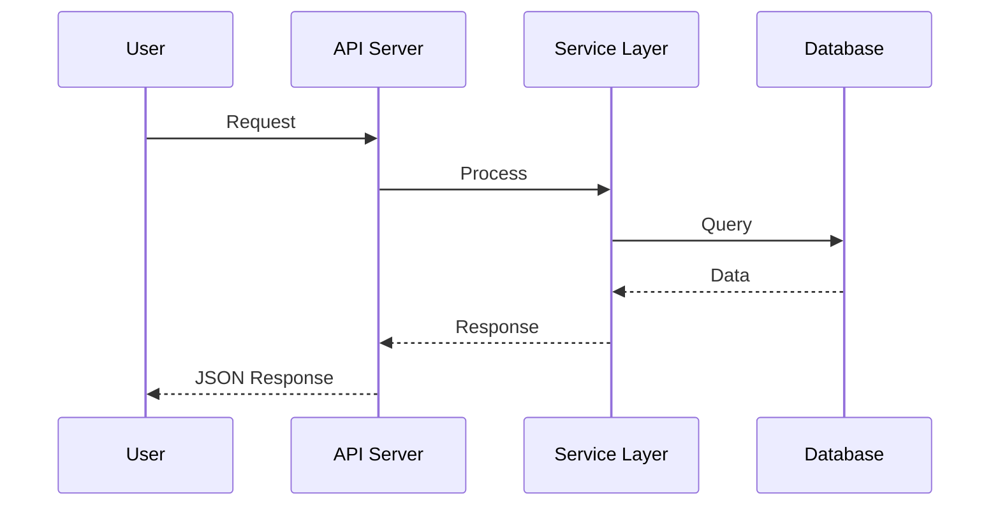
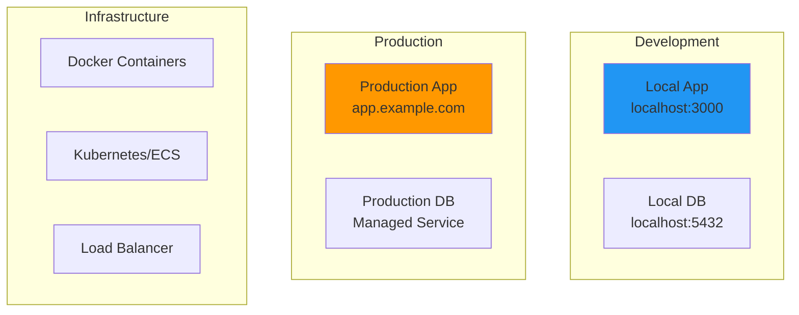

# ARCHITECTURE.md Template

**Document Status:** ACTIVE  
**Version:** 1.0  
**Date:** [DATE]  

---

## Table of Contents

1. [High-Level Architecture](#high-level-architecture)
2. [System Components](#system-components)
3. [Key Technologies](#key-technologies)
4. [Data Flow](#data-flow)
5. [Deployment Architecture](#deployment-architecture)
6. [Architecture Decisions](#architecture-decisions)

---

## High-Level Architecture

### System Overview

**Key Characteristics:**
- [Describe how your system works at high level]
- [What are the main parts?]
- [How do they interact?]

---

## System Components

### Component 1: [Name]

**Responsibilities:**
- [What does this component do?]
- [What is it responsible for?]

**Location:** [Where in codebase]

**Key Technologies:** [Languages, frameworks]

---

### Component 2: [Name]

[Repeat structure for each component]

---

## Key Technologies

### Frontend
- [Framework/Library]: [Version]
- [Language]: [Version]
- [Tools]: [List]

### Backend
- [Framework/Language]: [Version]
- [Database]: [Type/Version]
- [Tools]: [List]

### Infrastructure
- [Container]: Docker, Kubernetes, etc.
- [Cloud]: AWS, GCP, Azure, etc.
- [CI/CD]: GitHub Actions, Jenkins, etc.

---

## Data Flow

### User Request to Response

**Flow Description:**
[Explain what happens at each step]

---

## Deployment Architecture

### Environment Setup

**Deployment Details:**
- [How is the system deployed?]
- [What environments exist?]
- [Port mappings, if applicable]

---

## Architecture Decisions

### Decision 1: [Decision Title]

**Decision:** [What was chosen]

**Rationale:** [Why was this chosen]
- [Reason 1]
- [Reason 2]
- [Reason 3]

**Trade-offs:** [What was sacrificed]
- [Trade-off 1]
- [Trade-off 2]

**Alternatives Considered:**
- [Alternative 1]
- [Alternative 2]

---

### Decision 2: [Decision Title]

[Repeat structure for each major decision]

---

## Scaling Considerations

[How does the system scale?]

- Horizontal scaling: [Approach]
- Vertical scaling: [Approach]
- Performance bottlenecks: [What limits growth]
- Mitigation strategies: [How to address limits]

---

## Known Limitations & Future Work

[What are the current constraints?]

- [Limitation 1]
- [Limitation 2]

[What's planned?]

- [Future work 1]
- [Future work 2]

---

## Related Requirements

For specifications related to this architecture:

- [REQ-A001: Architecture Requirement Title](requirements/architecture/REQ-A001.md)
- [REQ-A002: Another Requirement](requirements/architecture/REQ-A002.md)

See `requirements/README.md` for complete list.

---

**For questions or updates:** See GAP_ANALYSIS.md for known issues, or open a requirement in requirements/ directory.
